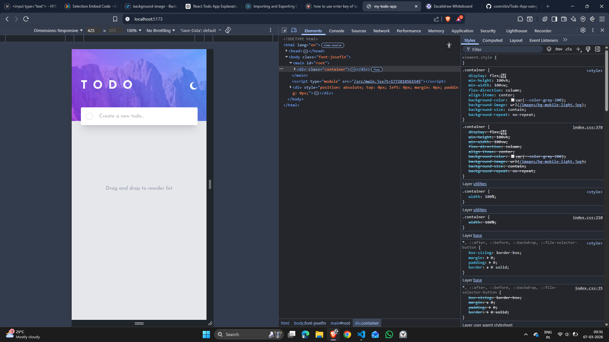
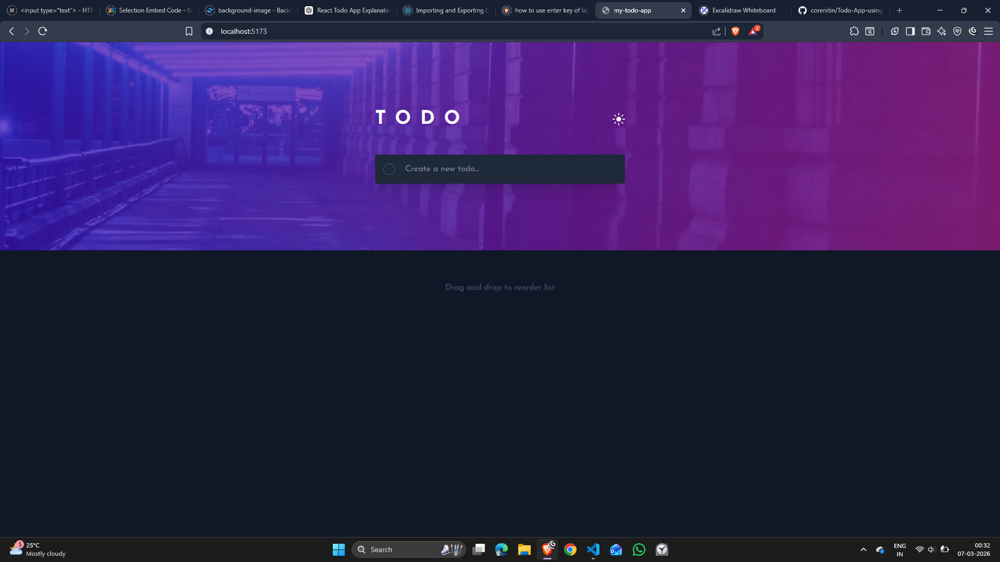

# Todo app solution 

## Table of contents

- [Overview](#overview)
  - [The challenge](#the-challenge)
  - [Screenshot](#screenshot)
  - [Links](#links)
- [My process](#my-process)
  - [Built with](#built-with)
  - [What I learned](#what-i-learned)
  - [Continued development](#continued-development)
  - [Useful resources](#useful-resources)
  - [AI Collaboration](#ai-collaboration)
- [Author](#author)
- [Acknowledgments](#acknowledgments)

**Note: Delete this note and update the table of contents based on what sections you keep.**

## Overview

### The challenge

Users should be able to:

- View the optimal layout for the app depending on their device's screen size
- See hover states for all interactive elements on the page
- Add new todos to the list
- Mark todos as complete
- Delete todos from the list
- Filter by all/active/complete todos
- Clear all completed todos
- Toggle light and dark mode
- **Bonus**: Drag and drop to reorder items on the list

### Screenshot

### Links

- Solution URL: [https://github.com/corenitin/Todo-App-using-React]
- Live Site URL: [https://your-live-site-url.com]

## My process

### Built with

- Semantic HTML5 markup
- CSS custom properties
- Flexbox
- CSS Grid
- Mobile-first workflow
- [React](https://reactjs.org/) - JS library

### What I learned

Through this project, I learned many important concepts in React. I understood how different components work together and how React simplifies UI rendering and event handling.

I also learned that React has many useful libraries that make development easier. For example, I used a library to implement drag-and-drop functionality in the application.

During this project, I gained a better understanding of how JSX works and how React integrates with Tailwind CSS. I also realized that in some situations, writing custom CSS is still necessary.

Additionally, I learned how to implement dark mode in a React application.

### Continued development

In the future, I plan to build more complex React projects to strengthen my frontend development skills. I also plan to learn backend technologies so that I can develop full-stack applications and build complete end-to-end projects.

### Useful resources

- [https://developer.mozilla.org/en-US/] - The MDN documentation helped me strengthen my fundamentals and improve my understanding of JavaScript, HTML, and CSS.
- [https://tailwindcss.com/] - Tailwind CSS documentation helped me create clean and efficient styling using minimal utility classes. It made the styling process faster and easier while building the user interface.

### AI Collaboration

I used ChatGPT to better understand certain concepts and to help identify bugs in my code. When I encountered complex problems, ChatGPT helped guide me toward possible solutions and approaches to solve them.

